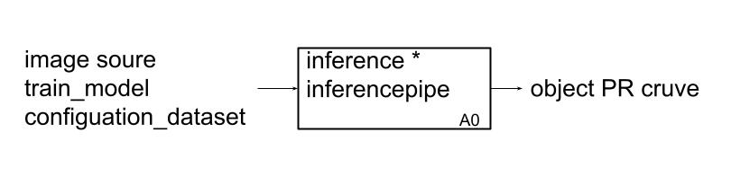
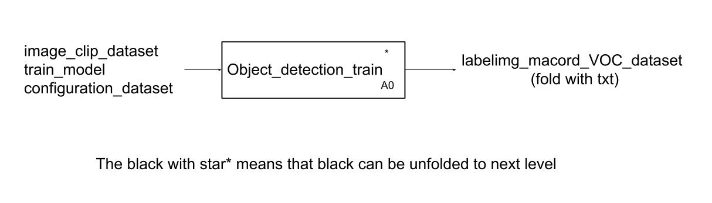
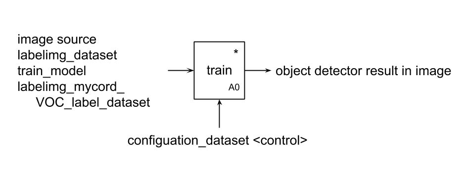
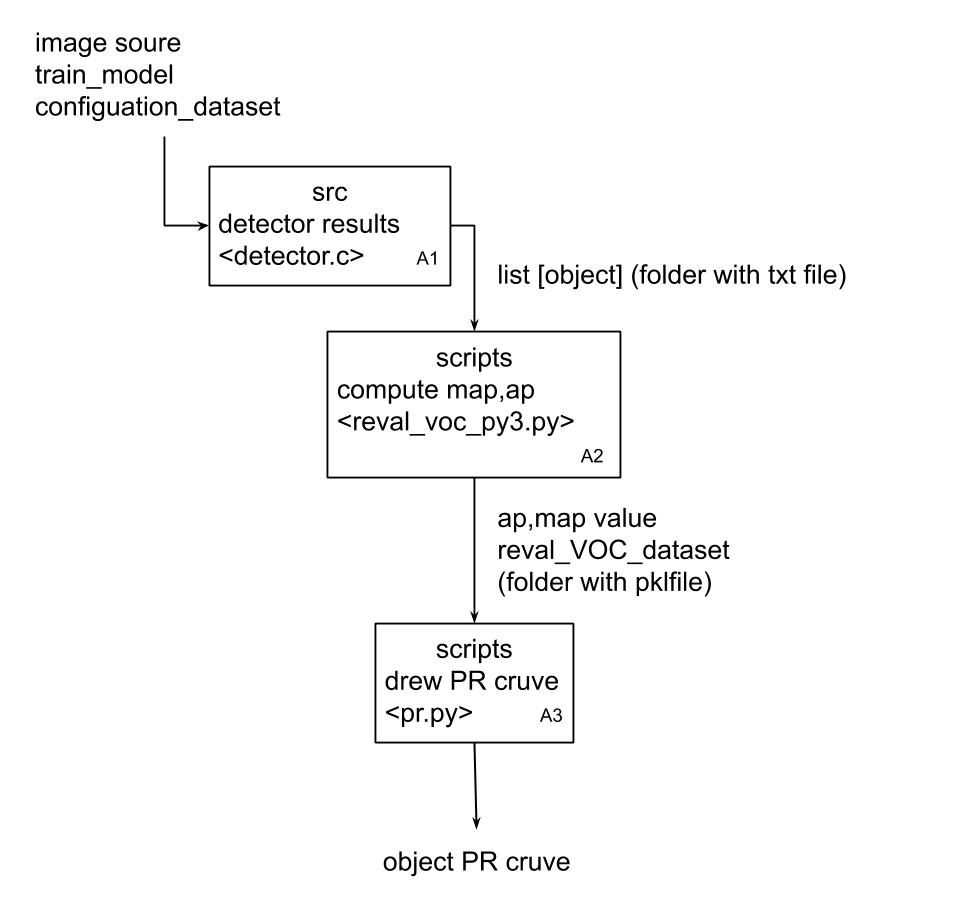
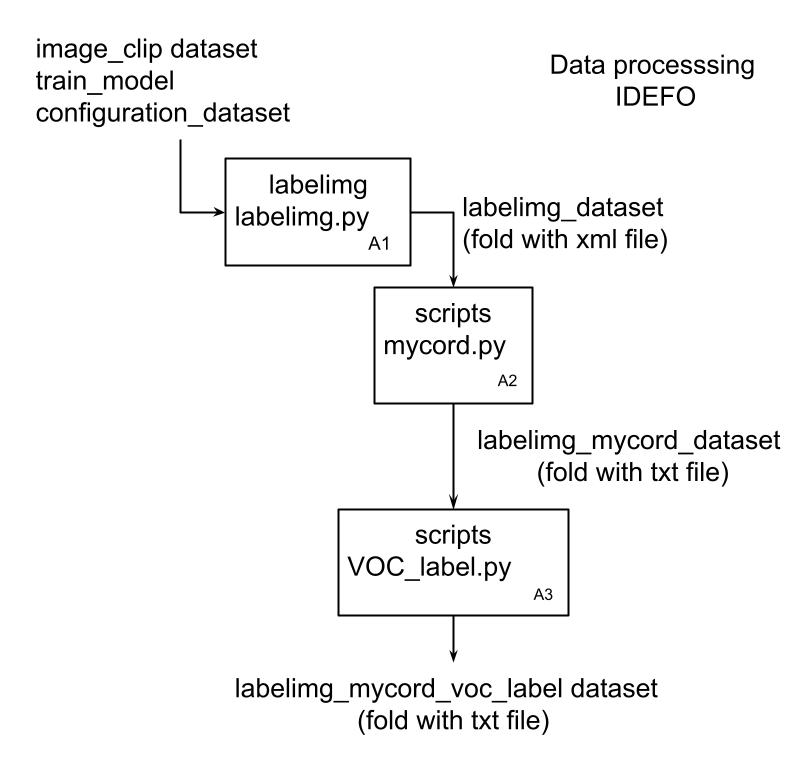
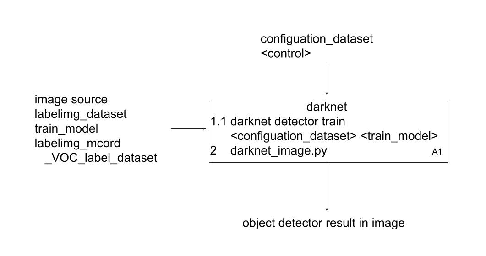
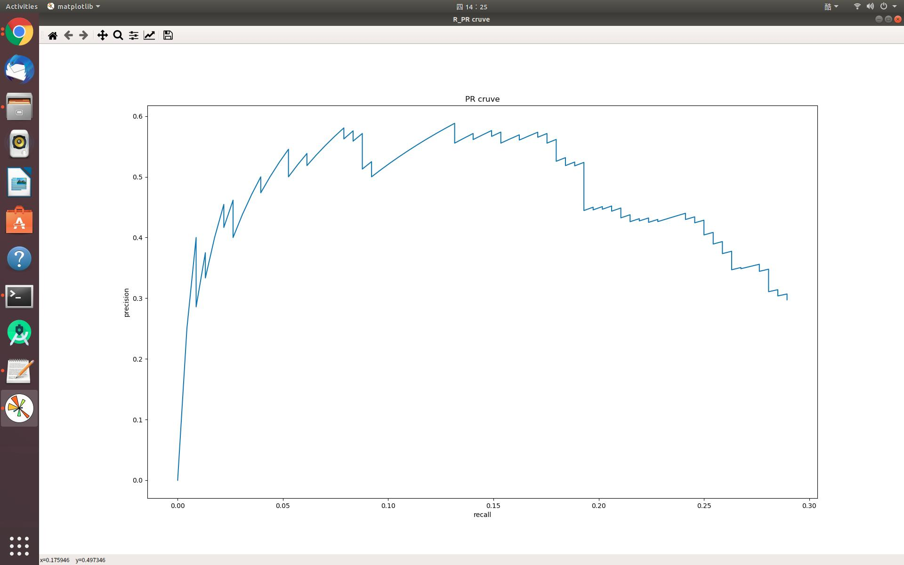
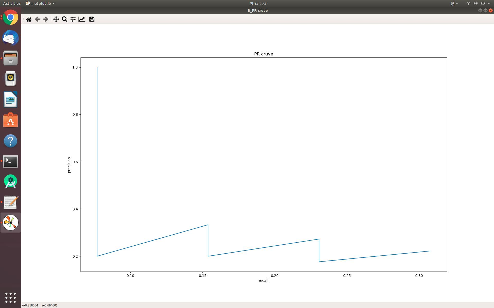
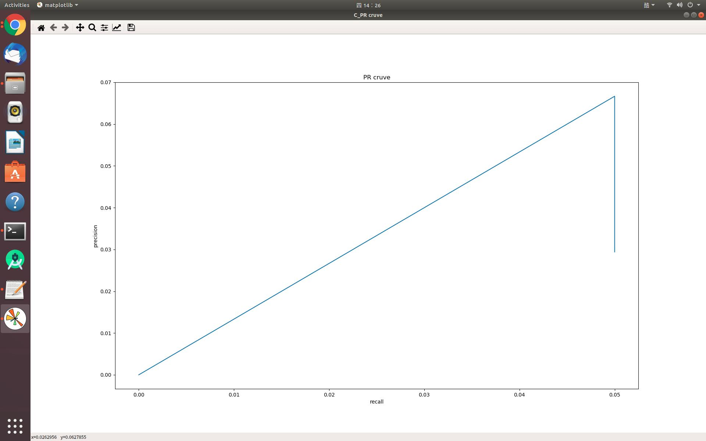
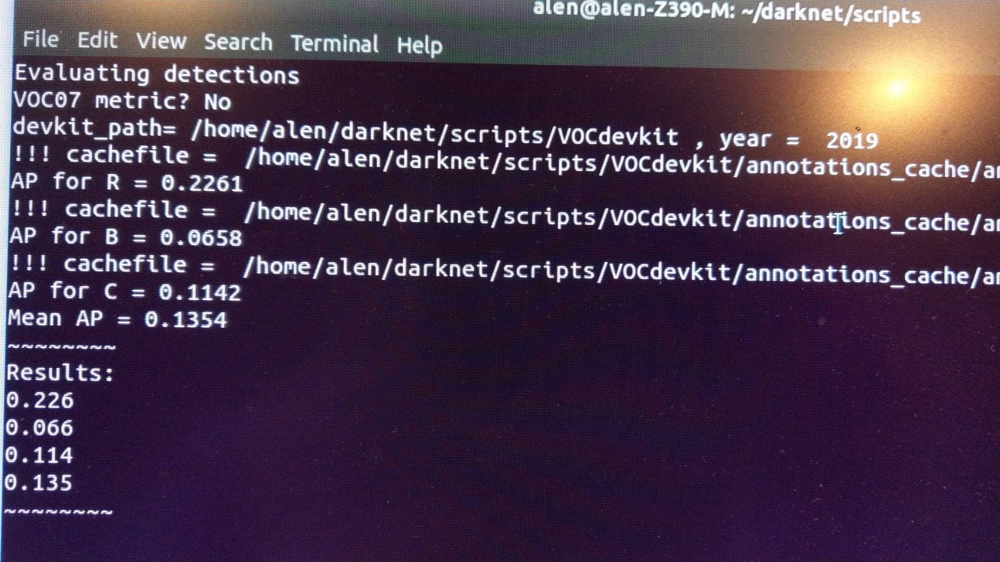

# Object_Detction_YoloV3

## Yolo v3 for Linux
# IDEF0

**The block with star  * means that block can be unfolded to next level.**

## A0

### Inference

</img>

### Training_before
</img>

### Training
</img>

## A1

### Inference

</img>

### Training_before
</img>

### Training
</img>


### (neural networks for object detection)

Manual: https://github.com/pjreddie/darknet

About Darknet framework: https://pjreddie.com/darknet/yolo/

* [Requirements (and how to install dependecies)](#requirements)
* [Pre-trained models](#pre-trained-models)
* [Yolo v4 in other frameworks (TensorRT, TensorFlow, PyTorch, OpenVINO, OpenCV-dnn, TVM,...)](#yolo-v4-in-other-frameworks)
* [Datasets](#datasets)

1. How to compile on Linux
   * [Using cmake](#how-to-compile-on-linux-using-cmake)
   * [Using make](#how-to-compile-on-linux-using-make)
2. [Training and Evaluation of speed and accuracy on MS COCO](https://github.com/AlexeyAB/darknet/wiki#training-and-evaluation-of-speed-and-accuracy-on-ms-coco)
3. [How to train with multi-GPU:](#how-to-train-with-multi-gpu)
4. [How to train (to detect your custom objects)](#how-to-train-to-detect-your-custom-objects)
5. [How to train tiny-yolo (to detect your custom objects)](#how-to-train-tiny-yolo-to-detect-your-custom-objects)
6. [How to improve object detection](#how-to-improve-object-detection)

#### How to evaluate AP of YOLOv3 on the MS COCO evaluation server

1. Download and unzip test-dev2017 dataset from MS COCO server: http://images.cocodataset.org/zips/test2017.zip
2. Download list of images for Detection taks and replace the paths with yours: https://raw.githubusercontent.com/AlexeyAB/darknet/master/scripts/testdev2017.txt
3. Download `yolov3.weights` file 245 MB: [yolov3.weights](https://drive.google.com/drive/folders/1026kpMYB5RChSiy4vo5O1RdX1gwzZmrg)
(https://drive.google.com/open?id=1cewMfusmPjYWbrnuJRuKhPMwRe_b9PaT) )
4. Content of the file `cfg/coco.data` should be

```ini
classes= 80
train  = <replace with your path>/trainvalno5k.txt
valid = <replace with your path>/testdev2017.txt
names = data/coco.names
backup = backup
eval=coco
```
5. Create `/results/` folder near with `./darknet` executable file
6. Run validation: `./darknet detector valid cfg/coco.data cfg/yolov4.cfg yolov4.weights`
7. Rename the file  `/results/coco_results.json` to `detections_test-dev2017_yolov4_results.json` and compress it to `detections_test-dev2017_yolov4_results.zip`
8. Submit file `detections_test-dev2017_yolov4_results.zip` to the MS COCO evaluation server for the `test-dev2019 (bbox)`

#### How to evaluate FPS of YOLOv3 on GPU

1. Compile Darknet with `GPU=1 CUDNN=1 CUDNN_HALF=1 OPENCV=1` in the `Makefile`
2. Download `darknet53.conv.74` file 245 MB: [darknet53.conv.74](https://drive.google.com/drive/folders/1026kpMYB5RChSiy4vo5O1RdX1gwzZmrg) 
3. Get any .avi/.mp4 video file (preferably not more than 1920x1080 to avoid bottlenecks in CPU performance)
4. Run one of two commands and look at the AVG FPS:

* include video_capturing + NMS + drawing_bboxes: 
    `./darknet detector demo cfg/coco.data cfg/yolov3.cfg yolov3.weights test.mp4 -dont_show -ext_output`
* exclude video_capturing + NMS + drawing_bboxes: 
    `./darknet detector demo cfg/coco.data cfg/yolov3.cfg yolov3.weights test.mp4 -benchmark`

#### Pre-trained models

There are weights-file for different cfg-files (trained for MS COCO dataset):

FPS on RTX 2070 (R) and Tesla V100 (V):

* [yolov4.cfg](https://raw.githubusercontent.com/AlexeyAB/darknet/master/cfg/yolov4.cfg) - 245 MB: [yolov3.weights](https://github.com/AlexeyAB/darknet/releases/download/darknet_yolo_v3_optimal/yolov3.weights) 
    just change `width=` and `height=` parameters in `yolov3.cfg` file and use the same `yolov3.weights`(darknet53.conv.74) file for all cases:
  * `width=608 height=608` in cfg: **65.7% mAP@0.5 (43.5% AP@0.5:0.95) - 34(R) FPS / 62(V) FPS** - 128.5 BFlops
  * `width=512 height=512` in cfg: **64.9% mAP@0.5 (43.0% AP@0.5:0.95) - 45(R) FPS / 83(V) FPS** - 91.1 BFlops
  * `width=416 height=416` in cfg: **62.8% mAP@0.5 (41.2% AP@0.5:0.95) - 55(R) FPS / 96(V) FPS** - 60.1 BFlops
  * `width=320 height=320` in cfg:   **60% mAP@0.5 (  38% AP@0.5:0.95) - 63(R) FPS / 123(V) FPS** - 35.5 BFlops


### Requirements

* Windows or Linux
* **CMake >= 3.12**: https://cmake.org/download/
* **CUDA >= 9.0**: https://developer.nvidia.com/cuda-toolkit-archive (on Linux do [Post-installation Actions](https://docs.nvidia.com/cuda/cuda-installation-guide-linux/index.html#post-installation-actions))
* **OpenCV >= 4.2.0**: use your preferred package manager (brew, apt), build from source using [vcpkg](https://github.com/Microsoft/vcpkg) or download from [OpenCV official site](https://opencv.org/releases.html) (on Windows set system variable `OpenCV_DIR` = `C:\opencv\build` - where are the `include` and `x64` folders [image](https://user-images.githubusercontent.com/4096485/53249516-5130f480-36c9-11e9-8238-a6e82e48c6f2.png))
* **cuDNN >= 7.0.5** https://developer.nvidia.com/rdp/cudnn-archive (on **Linux** copy `cudnn.h`,`libcudnn.so`... as desribed here https://docs.nvidia.com/deeplearning/sdk/cudnn-install/index.html#installlinux-tar , on **Windows** copy `cudnn.h`,`cudnn64_7.dll`, `cudnn64_7.lib` as desribed here https://docs.nvidia.com/deeplearning/sdk/cudnn-install/index.html#installwindows )
* **GPU with CC >= 3.0**: https://en.wikipedia.org/wiki/CUDA#GPUs_supported
* on Linux **GCC or Clang**, on Windows **MSVC 2017/2019** https://visualstudio.microsoft.com/thank-you-downloading-visual-studio/?sku=Community

#### Datasets

* MS COCO: use this parsers:https://drive.google.com/drive/folders/14jaFTkxxoti1glsXJpTNi5ftGvEwyh5p

### How to compile on Linux (using `make`)

Just do `make` in the darknet directory. (You can try to compile and run it on Google Colab in cloud [link](https://colab.research.google.com/drive/12QusaaRj_lUwCGDvQNfICpa7kA7_a2dE) (press «Open in Playground» button at the top-left corner) and watch the video [link](https://www.youtube.com/watch?v=mKAEGSxwOAY) )
Before make, you can set such options in the `Makefile`: [link](https://github.com/AlexeyAB/darknet/blob/9c1b9a2cf6363546c152251be578a21f3c3caec6/Makefile#L1)

* `GPU=1` to build with CUDA to accelerate by using GPU (CUDA should be in `/usr/local/cuda`)
* `CUDNN=1` to build with cuDNN v5-v7 to accelerate training by using GPU (cuDNN should be in `/usr/local/cudnn`)
* `CUDNN_HALF=1` to build for Tensor Cores (on Titan V / Tesla V100 / DGX-2 and later) speedup Detection 3x, Training 2x
* `OPENCV=1` to build with OpenCV 4.x/3.x/2.4.x - allows to detect on video files and video streams from network cameras or web-cams
* `DEBUG=1` to bould debug version of Yolo
* `OPENMP=1` to build with OpenMP support to accelerate Yolo by using multi-core CPU
* `LIBSO=1` to build a library `darknet.so` and binary runable file `uselib` that uses this library. Or you can try to run so `LD_LIBRARY_PATH=./:$LD_LIBRARY_PATH ./uselib test.mp4` How to use this SO-library from your own code - you can look at C++ example: https://github.com/AlexeyAB/darknet/blob/master/src/yolo_console_dll.cpp
    or use in such a way: `LD_LIBRARY_PATH=./:$LD_LIBRARY_PATH ./uselib data/coco.names cfg/yolov4.cfg yolov4.weights test.mp4`
* `ZED_CAMERA=1` to build a library with ZED-3D-camera support (should be ZED SDK installed), then run
    `LD_LIBRARY_PATH=./:$LD_LIBRARY_PATH ./uselib data/coco.names cfg/yolov4.cfg yolov4.weights zed_camera`

To run Darknet on Linux use examples from this article, just use `./darknet` instead of `darknet.exe`, i.e. use this command: `./darknet detector test ./cfg/coco.data ./cfg/yolov4.cfg ./yolov4.weights`

## How to train with multi-GPU

1. Train it first on 1 GPU for like 1000 iterations: `darknet.exe detector train cfg/coco.data cfg/yolov4.cfg yolov4.conv.137`

2. Then stop and by using partially-trained model `/backup/yolov4_1000.weights` run training with multigpu (up to 4 GPUs): `darknet.exe detector train cfg/coco.data cfg/yolov4.cfg /backup/yolov4_1000.weights -gpus 0,1,2,3`

If you get a Nan, then for some datasets better to decrease learning rate, for 4 GPUs set `learning_rate = 0,00065` (i.e. learning_rate = 0.00261 / GPUs). In this case also increase 4x times `burn_in =` in your cfg-file. I.e. use `burn_in = 4000` instead of `1000`.

https://groups.google.com/d/msg/darknet/NbJqonJBTSY/Te5PfIpuCAAJ

## How to train (to detect your custom objects)

Training Yolo v4:

0. For training `cfg/yolov4-custom.cfg` download the pre-trained weights-file (162 MB): [yolov4.conv.137](https://github.com/AlexeyAB/darknet/releases/download/darknet_yolo_v3_optimal/yolov4.conv.137) (Google drive mirror [yolov4.conv.137](https://drive.google.com/open?id=1JKF-bdIklxOOVy-2Cr5qdvjgGpmGfcbp) )

1. Create file `yolo-obj.cfg` with the same content as in `yolov4-custom.cfg` (or copy `yolov4-custom.cfg` to `yolo-obj.cfg)` and:

* change line batch to [`batch=64`](https://github.com/AlexeyAB/darknet/blob/0039fd26786ab5f71d5af725fc18b3f521e7acfd/cfg/yolov3.cfg#L3)
* change line subdivisions to [`subdivisions=16`](https://github.com/AlexeyAB/darknet/blob/0039fd26786ab5f71d5af725fc18b3f521e7acfd/cfg/yolov3.cfg#L4)
* change line max_batches to (`classes*2000` but not less than number of training images, but not less than number of training images and not less than `6000`), f.e. [`max_batches=6000`](https://github.com/AlexeyAB/darknet/blob/0039fd26786ab5f71d5af725fc18b3f521e7acfd/cfg/yolov3.cfg#L20) if you train for 3 classes
* change line steps to 80% and 90% of max_batches, f.e. [`steps=4800,5400`](https://github.com/AlexeyAB/darknet/blob/0039fd26786ab5f71d5af725fc18b3f521e7acfd/cfg/yolov3.cfg#L22)
* set network size `width=416 height=416` or any value multiple of 32: https://github.com/AlexeyAB/darknet/blob/0039fd26786ab5f71d5af725fc18b3f521e7acfd/cfg/yolov3.cfg#L8-L9
* change line `classes=80` to your number of objects in each of 3 `[yolo]`-layers:
  * https://github.com/AlexeyAB/darknet/blob/0039fd26786ab5f71d5af725fc18b3f521e7acfd/cfg/yolov3.cfg#L610
  * https://github.com/AlexeyAB/darknet/blob/0039fd26786ab5f71d5af725fc18b3f521e7acfd/cfg/yolov3.cfg#L696
  * https://github.com/AlexeyAB/darknet/blob/0039fd26786ab5f71d5af725fc18b3f521e7acfd/cfg/yolov3.cfg#L783
* change [`filters=255`] to filters=(classes + 5)x3 in the 3 `[convolutional]` before each `[yolo]` layer, keep in mind that it only has to be the last `[convolutional]` before each of the `[yolo]` layers.
  * https://github.com/AlexeyAB/darknet/blob/0039fd26786ab5f71d5af725fc18b3f521e7acfd/cfg/yolov3.cfg#L603
  * https://github.com/AlexeyAB/darknet/blob/0039fd26786ab5f71d5af725fc18b3f521e7acfd/cfg/yolov3.cfg#L689
  * https://github.com/AlexeyAB/darknet/blob/0039fd26786ab5f71d5af725fc18b3f521e7acfd/cfg/yolov3.cfg#L776
* when using [`[Gaussian_yolo]`](https://github.com/AlexeyAB/darknet/blob/6e5bdf1282ad6b06ed0e962c3f5be67cf63d96dc/cfg/Gaussian_yolov3_BDD.cfg#L608)  layers, change [`filters=57`] filters=(classes + 9)x3 in the 3 `[convolutional]` before each `[Gaussian_yolo]` layer
  * https://github.com/AlexeyAB/darknet/blob/6e5bdf1282ad6b06ed0e962c3f5be67cf63d96dc/cfg/Gaussian_yolov3_BDD.cfg#L604
  * https://github.com/AlexeyAB/darknet/blob/6e5bdf1282ad6b06ed0e962c3f5be67cf63d96dc/cfg/Gaussian_yolov3_BDD.cfg#L696
  * https://github.com/AlexeyAB/darknet/blob/6e5bdf1282ad6b06ed0e962c3f5be67cf63d96dc/cfg/Gaussian_yolov3_BDD.cfg#L789

So if `classes=1` then should be `filters=18`. If `classes=2` then write `filters=21`.
  
**(Do not write in the cfg-file: filters=(classes + 5)x3)**
  
(Generally `filters` depends on the `classes`, `coords` and number of `mask`s, i.e. filters=`(classes + coords + 1)*<number of mask>`, where `mask` is indices of anchors. If `mask` is absence, then filters=`(classes + coords + 1)*num`)

So for example, for 2 objects, your file `yolo-obj.cfg` should differ from `yolov4-custom.cfg` in such lines in each of **3** [yolo]-layers:

```ini
[convolutional]
filters=21

[region]
classes=2
```

2. Create file `obj.names` in the directory `build\darknet\x64\data\`, with objects names - each in new line

3. Create file `obj.data` in the directory `build\darknet\x64\data\`, containing (where **classes = number of objects**):

  ```ini
  classes = 2
  train  = data/train.txt
  valid  = data/test.txt
  names = data/obj.names
  backup = backup/
  ```

4. Put image-files (.jpg) of your objects in the directory `build\darknet\x64\data\obj\`

5. You should label each object on images from your dataset. Use this visual GUI-software for marking bounded boxes of objects and generating annotation files for Yolo v2 & v3: https://github.com/AlexeyAB/Yolo_mark

It will create `.txt`-file for each `.jpg`-image-file - in the same directory and with the same name, but with `.txt`-extension, and put to file: object number and object coordinates on this image, for each object in new line: 

`<object-class> <x_center> <y_center> <width> <height>`

  Where: 
  * `<object-class>` - integer object number from `0` to `(classes-1)`
  * `<x_center> <y_center> <width> <height>` - float values **relative** to width and height of image, it can be equal from `(0.0 to 1.0]`
  * for example: `<x> = <absolute_x> / <image_width>` or `<height> = <absolute_height> / <image_height>`
  * atention: `<x_center> <y_center>` - are center of rectangle (are not top-left corner)

  For example for `img1.jpg` you will be created `img1.txt` containing:

  ```
  1 0.716797 0.395833 0.216406 0.147222
  0 0.687109 0.379167 0.255469 0.158333
  1 0.420312 0.395833 0.140625 0.166667
  ```

6. Create file `train.txt` in directory `build\darknet\x64\data\`, with filenames of your images, each filename in new line, with path relative to `darknet.exe`, for example containing:

  ```
  data/obj/img1.jpg
  data/obj/img2.jpg
  data/obj/img3.jpg
  ```

7. Download pre-trained weights for the convolutional layers and put to the directory `build\darknet\x64`
    * for `yolov4.cfg`, `yolov4-custom.cfg` (162 MB): [yolov4.conv.137](https://github.com/AlexeyAB/darknet/releases/download/darknet_yolo_v3_optimal/yolov4.conv.137) (Google drive mirror [yolov4.conv.137](https://drive.google.com/open?id=1JKF-bdIklxOOVy-2Cr5qdvjgGpmGfcbp) )
    * for `yolov4-tiny.cfg`, `yolov4-tiny-3l.cfg`, `yolov4-tiny-custom.cfg` (19 MB): [yolov4-tiny.conv.29](https://github.com/AlexeyAB/darknet/releases/download/darknet_yolo_v4_pre/yolov4-tiny.conv.29)  

8. Start training by using the command line: `darknet.exe detector train data/obj.data yolo-obj.cfg yolov4.conv.137`
     
   To train on Linux use command: `./darknet detector train data/obj.data yolo-obj.cfg yolov4.conv.137` (just use `./darknet` instead of `darknet.exe`)
     
   * (file `yolo-obj_last.weights` will be saved to the `build\darknet\x64\backup\` for each 100 iterations)
   * (file `yolo-obj_xxxx.weights` will be saved to the `build\darknet\x64\backup\` for each 1000 iterations)
   * (to disable Loss-Window use `darknet.exe detector train data/obj.data yolo-obj.cfg yolov4.conv.137 -dont_show`, if you train on computer without monitor like a cloud Amazon EC2)
   * (to see the mAP & Loss-chart during training on remote server without GUI, use command `darknet.exe detector train data/obj.data yolo-obj.cfg yolov4.conv.137 -dont_show -mjpeg_port 8090 -map` then open URL `http://ip-address:8090` in Chrome/Firefox browser)

8.1. For training with mAP (mean average precisions) calculation for each 4 Epochs (set `valid=valid.txt` or `train.txt` in `obj.data` file) and run: `darknet.exe detector train data/obj.data yolo-obj.cfg yolov4.conv.137 -map`

9. After training is complete - get result `yolo-obj_final.weights` from path `build\darknet\x64\backup\`

 * After each 100 iterations you can stop and later start training from this point. For example, after 2000 iterations you can stop training, and later just start training using: `darknet.exe detector train data/obj.data yolo-obj.cfg backup\yolo-obj_2000.weights`

    (in the original repository https://github.com/pjreddie/darknet the weights-file is saved only once every 10 000 iterations `if(iterations > 1000)`)

 * Also you can get result earlier than all 45000 iterations.
 
 **Note:** If during training you see `nan` values for `avg` (loss) field - then training goes wrong, but if `nan` is in some other lines - then training goes well.
 
 **Note:** If you changed width= or height= in your cfg-file, then new width and height must be divisible by 32.
 
 **Note:** After training use such command for detection: `darknet.exe detector test data/obj.data yolo-obj.cfg yolo-obj_8000.weights`
 
  **Note:** if error `Out of memory` occurs then in `.cfg`-file you should increase `subdivisions=16`, 32 or 64: [link](https://github.com/AlexeyAB/darknet/blob/0039fd26786ab5f71d5af725fc18b3f521e7acfd/cfg/yolov3.cfg#L4)
 
### How to train tiny-yolo (to detect your custom objects):

Do all the same steps as for the full yolo model as described above. With the exception of:
* Download file with the first 29-convolutional layers of yolov4-tiny: https://github.com/AlexeyAB/darknet/releases/download/darknet_yolo_v4_pre/yolov4-tiny.conv.29
 (Or get this file from yolov4-tiny.weights file by using command: `darknet.exe partial cfg/yolov4-tiny-custom.cfg yolov4-tiny.weights yolov4-tiny.conv.29 29`
* Make your custom model `yolov4-tiny-obj.cfg` based on `cfg/yolov4-tiny-custom.cfg` instead of `yolov4.cfg`
* Start training: `darknet.exe detector train data/obj.data yolov4-tiny-obj.cfg yolov4-tiny.conv.29`

For training Yolo based on other models ([DenseNet201-Yolo](https://github.com/AlexeyAB/darknet/blob/master/build/darknet/x64/densenet201_yolo.cfg) or [ResNet50-Yolo](https://github.com/AlexeyAB/darknet/blob/master/build/darknet/x64/resnet50_yolo.cfg)), you can download and get pre-trained weights as showed in this file: https://github.com/AlexeyAB/darknet/blob/master/build/darknet/x64/partial.cmd
If you made you custom model that isn't based on other models, then you can train it without pre-trained weights, then will be used random initial weights.
 
## How to improve object detection:

1. Before training:

* set flag `random=1` in your `.cfg`-file - it will increase precision by training Yolo for different resolutions: [link](https://github.com/AlexeyAB/darknet/blob/0039fd26786ab5f71d5af725fc18b3f521e7acfd/cfg/yolov3.cfg#L788)

* increase network resolution in your `.cfg`-file (`height=608`, `width=608` or any value multiple of 32) - it will increase precision

* check that each object that you want to detect is mandatory labeled in your dataset - no one object in your data set should not be without label. In the most training issues - there are wrong labels in your dataset (got labels by using some conversion script, marked with a third-party tool, ...). Always check your dataset by using: https://github.com/AlexeyAB/Yolo_mark

* my Loss is very high and mAP is very low, is training wrong? Run training with ` -show_imgs` flag at the end of training command, do you see correct bounded boxes of objects (in windows or in files `aug_...jpg`)? If no - your training dataset is wrong.

* for each object which you want to detect - there must be at least 1 similar object in the Training dataset with about the same: shape, side of object, relative size, angle of rotation, tilt, illumination. So desirable that your training dataset include images with objects at diffrent: scales, rotations, lightings, from different sides, on different backgrounds - you should preferably have 2000 different images for each class or more, and you should train `2000*classes` iterations or more

* desirable that your training dataset include images with non-labeled objects that you do not want to detect - negative samples without bounded box (empty `.txt` files) - use as many images of negative samples as there are images with objects

* What is the best way to mark objects: label only the visible part of the object, or label the visible and overlapped part of the object, or label a little more than the entire object (with a little gap)? Mark as you like - how would you like it to be detected.

* for training with a large number of objects in each image, add the parameter `max=200` or higher value in the last `[yolo]`-layer or `[region]`-layer in your cfg-file (the global maximum number of objects that can be detected by YoloV3 is `0,0615234375*(width*height)` where are width and height are parameters from `[net]` section in cfg-file) 
  
* for training for small objects (smaller than 16x16 after the image is resized to 416x416) - set `layers = 23` instead of https://github.com/AlexeyAB/darknet/blob/6f718c257815a984253346bba8fb7aa756c55090/cfg/yolov4.cfg#L895
  * set `stride=4` instead of https://github.com/AlexeyAB/darknet/blob/6f718c257815a984253346bba8fb7aa756c55090/cfg/yolov4.cfg#L892
  * set `stride=4` instead of https://github.com/AlexeyAB/darknet/blob/6f718c257815a984253346bba8fb7aa756c55090/cfg/yolov4.cfg#L989
  
* for training for both small and large objects use modified models:
  * Full-model: 5 yolo layers: https://raw.githubusercontent.com/AlexeyAB/darknet/master/cfg/yolov3_5l.cfg
  * Tiny-model: 3 yolo layers: https://raw.githubusercontent.com/AlexeyAB/darknet/master/cfg/yolov4-tiny_3l.cfg
  * YOLOv4: 3 yolo layers: https://raw.githubusercontent.com/AlexeyAB/darknet/master/cfg/yolov4-custom.cfg
  
* If you train the model to distinguish Left and Right objects as separate classes (left/right hand, left/right-turn on road signs, ...) then for disabling flip data augmentation - add `flip=0` here: https://github.com/AlexeyAB/darknet/blob/3d2d0a7c98dbc8923d9ff705b81ff4f7940ea6ff/cfg/yolov3.cfg#L17
  
* General rule - your training dataset should include such a set of relative sizes of objects that you want to detect: 
  * `train_network_width * train_obj_width / train_image_width ~= detection_network_width * detection_obj_width / detection_image_width`
  * `train_network_height * train_obj_height / train_image_height ~= detection_network_height * detection_obj_height / detection_image_height`

  I.e. for each object from Test dataset there must be at least 1 object in the Training dataset with the same class_id and about the same relative size:

  `object width in percent from Training dataset` ~= `object width in percent from Test dataset` 

  That is, if only objects that occupied 80-90% of the image were present in the training set, then the trained network will not be able to detect objects that occupy 1-10% of the image.

* to speedup training (with decreasing detection accuracy) set param `stopbackward=1` for layer-136 in cfg-file

* each: `model of object, side, illimination, scale, each 30 grad` of the turn and inclination angles - these are *different objects* from an internal perspective of the neural network. So the more *different objects* you want to detect, the more complex network model should be used.

* to make the detected bounded boxes more accurate, you can add 3 parameters `ignore_thresh = .9 iou_normalizer=0.5 iou_loss=giou` to each `[yolo]` layer and train, it will increase mAP@0.9, but decrease mAP@0.5.

* Only if you are an **expert** in neural detection networks - recalculate anchors for your dataset for `width` and `height` from cfg-file:
`darknet.exe detector calc_anchors data/obj.data -num_of_clusters 9 -width 416 -height 416`
then set the same 9 `anchors` in each of 3 `[yolo]`-layers in your cfg-file. But you should change indexes of anchors `masks=` for each [yolo]-layer, so for YOLOv4 the 1st-[yolo]-layer has anchors smaller than 30x30, 2nd smaller than 60x60, 3rd remaining, and vice versa for YOLOv3. Also you should change the `filters=(classes + 5)*<number of mask>` before each [yolo]-layer. If many of the calculated anchors do not fit under the appropriate layers - then just try using all the default anchors.

2. After training - for detection:

* Increase network-resolution by set in your `.cfg`-file (`height=608` and `width=608`) or (`height=832` and `width=832`) or (any value multiple of 32) - this increases the precision and makes it possible to detect small objects: [link](https://github.com/AlexeyAB/darknet/blob/0039fd26786ab5f71d5af725fc18b3f521e7acfd/cfg/yolov3.cfg#L8-L9)

* it is not necessary to train the network again, just use `.weights`-file already trained for 416x416 resolution

* to get even greater accuracy you should train with higher resolution 608x608 or 832x832, note: if error `Out of memory` occurs then in `.cfg`-file you should increase `subdivisions=16`, 32 or 64: [link]

# Test

This project was developed on Ubuntu 18.04, cuda 10.1, RTX 2080-Ti and OpenCV >= 2.4.  Next, we will explain the test instructions.
1. Test a single picture

     use: ./darknet detector test cfg/voc.data cfg/yolov4-voc.cfg backup/yolov4-voc_final.weights data/xxx.jpg
2. Test video

    use: ./darknet detector demo cfg/voc.data cfg/yolov3-voc.cfg backup/yolov3-voc_25000.weights data/XXXX.mp4
# Test data set

##  Batch testing
1. Batch testing-output text detection results(first)
     
     use: ./darknet detector valid cfg/voc.data cfg/yolov4-voc.cfg backup/yolov4-voc_final.weights
2. Batch testing-output text detection results(second)
     
     use: ./darknet detector test cfg/voc.data cfg/yolov4-voc.cfg backup/yolov4-voc_final.weights
## Calculate recall
1. Calculate recall

     use: ./darknet detector recall cfg/voc.data cfg/yolov3-voc.cfg backup/yolov3-voc_final.weights

     
## Drawing PR curve
1. drawing PR curve

     Run the program in /scripts：python pr.py
     
</img>
</img>
</img>

## Calculate ap,map
1.Calculate ap,map
     use: python reval_voc.py --voc_dir /home/dj/dingjing/darknet/scripts/VOCdevkit --year 2007 --image_set test --classes /home/dj/dingjing/darknet/data/dingall.names x
     </img>
    
     Note 1: x is the name of the new folder created by yourself, used to save the last generated .txt file
     Note 2: Generate plk file for drawing PR curve 


